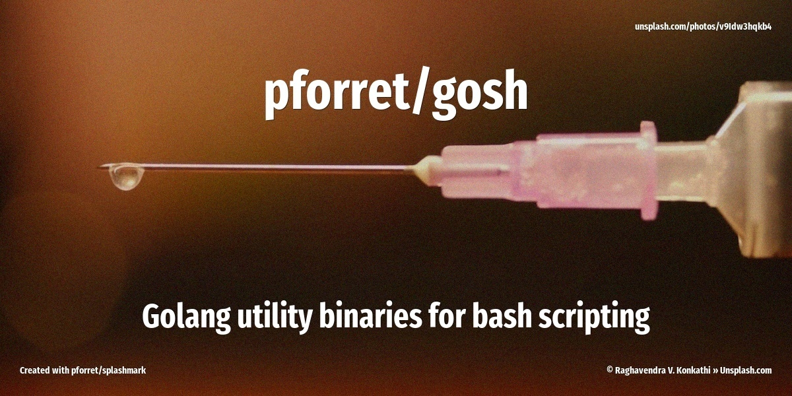

# pforret/gosh


Small functions that should have been in bash but aren't, developed in Golang

```
Usage:
  gosh [command]

Available Commands:
  completion  Generate the autocompletion script for the specified shell
  help        Help about any command
  microtime   return time in 'epoch' style (seconds since 1 Jan 1970)

Flags:
  -h, --help     help for gosh
  -t, --toggle   Help message for toggle

Use "gosh [command] --help" for more information about a command.
```
## subcommands

### gosh ascii
```
Convert Unicode text to ASCII characters
$ echo 'Îñtérnåtîönàlïsātìõń is $(AWESOME)!!' | gosh ascii
Internationalisation is $(AWESOME)!!

Usage:
  gosh ascii [flags]

Flags:
  -h, --help   help for ascii
```

### gosh microtime

```
returns time as an integer or as a float
> gosh microtime
1672080617
> gosh microtime true
1672080617.458

Usage:
  gosh microtime [flags]

Flags:
  -h, --help   help for microtime`
```

### gosh slug
```
Convert Unicode text into a slug
$ echo 'Îñtérnåtîönàlïsātìõń is $(AWESOME)!!' | bin/gosh-mac slug
internationalisation-is-awesome

Usage:
  gosh slug [flags]

Flags:
  -h, --help   help for slug
```